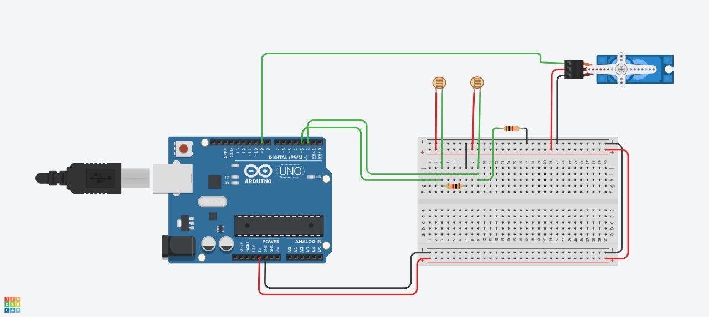
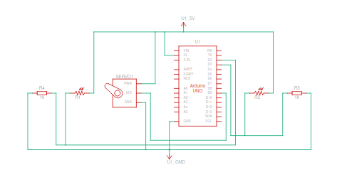

# SUNFLOWER - The Solar Tracker

Solar trackers are innovative systems designed to optimize the efficiency of solar panels by adjusting their position relative to the sun's movement throughout the day. This project focuses on building a dual-axis solar tracker using an Arduino microcontroller, light-dependent resistors (LDRs), and an SG90 servo motor. The LDRs act as sensors to detect light intensity, and the Arduino processes this data to adjust the panel's orientation, ensuring maximum exposure to sunlight.

## Table of Contents
- [Circuit_Diagram](#Circuit_Diagram)
- [Arduino_Connections](#Arduino_Connections)
- [Code_Explanation](#Code_Explanation)
- [Contributors](#Contributors)

This system enhances energy capture, offering a practical solution for renewable energy applications. The design is cost-effective, easy to implement, and provides real-time adaptability to varying sunlight conditions, promoting sustainable energy harvesting.

## Circuit_Diagram

[Tinkercad Model](https://www.tinkercad.com/things/2Fgswye4jNt-sunflower-the-solar-tracker/editel?returnTo=%2Fthings%2F2Fgswye4jNt-sunflower-the-solar-tracker&sharecode=4TqXwTdOOUxKVZXr8huWJwLxlzGhQlEd2Y1PEDoA4fs)

## Arduino_Connections

- LDR-1 is connected to Digital Pin D2 of Arduino Uno R3
- LDR-2 is connected to Digital Pin D3 of Arduino Uno R3
- Servo Motor Control Pin is connected to Digital Pin D9 of Arduino Uno R3

## Code_Explanation

The provided code is for a solar tracker system using an Arduino microcontroller. Here's a summary of its functionality:

### Components
- **Servo Motor**: Used to adjust the angle of the solar panel.
- **Light Dependent Resistors (LDRs)**: Used to detect light intensity.

### Initialization
- In the `setup()` function, the Servo is initialized to 90 degrees, and the LDRs are set as input.
- Serial communication is initialized to print debugging information.

### Operation
- In the `loop()` function, the system reads the states of the LDRs to determine light intensity.
- Depending on which LDR detects light, the Servo motor adjusts to 45, 90, or 135 degrees to optimize the solar panel's angle for maximum sunlight exposure.
- The states of the LDRs and the Servo position are printed to the Serial monitor for debugging purposes.

## Contributors

[@WhoHeRemains](https://github.com/WhoHeRemains),
[@PatoleRachanaSandeep](https://github.com/PatoleRachanaSandeep),
[@Kartik1384](https://github.com/Kartik1384) &
[@kartik-commits](https://github.com/kartik-commits)
